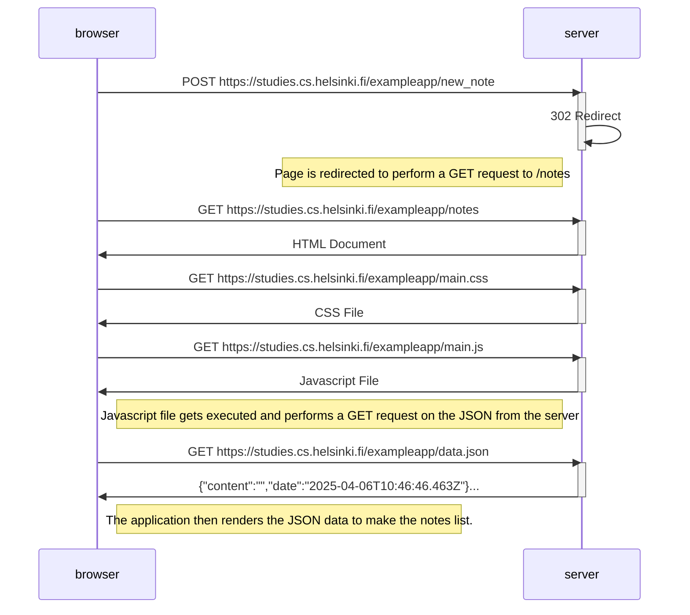

# Answer to Exercise 0.4

## MOOC Full Stack Open

```mermaid
sequenceDiagram
    participant browser
    participant server

    browser->>server: POST https://studies.cs.helsinki.fi/exampleapp/new_note 
    activate server
    server->>server: 302 Redirect
    deactivate server

    Note left of server: Page is redirected to perform a GET request to /notes

    browser->>server: GET https://studies.cs.helsinki.fi/exampleapp/notes
    activate server
    server->>browser: HTML Document
    deactivate server

    browser->>server: GET https://studies.cs.helsinki.fi/exampleapp/main.css
    activate server
    server->>browser: CSS File
    deactivate server

    browser->>server: GET https://studies.cs.helsinki.fi/exampleapp/main.js
    activate server
    server->>browser: Javascript File
    deactivate server

    Note right of browser: Javascript file gets executed and performs a GET request on the JSON from the server

    browser->>server: GET https://studies.cs.helsinki.fi/exampleapp/data.json
    activate server
    server->>browser: {"content":"","date":"2025-04-06T10:46:46.463Z"}...
    deactivate server

    Note right of browser: The application then renders the JSON data to make the notes list.
```