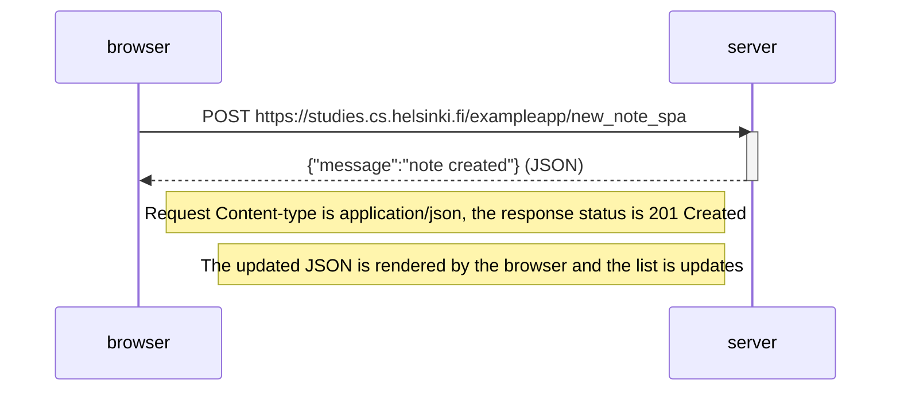

# Answer to Exercise 0.6

## MOOC Full Stack Open 2025

```mermaid
sequenceDiagram
    participant browser
    participant server

    browser->>server: POST https://studies.cs.helsinki.fi/exampleapp/new_note_spa
    activate server
    server-->>browser: {"message":"note created"} (JSON)
    deactivate server

    Note right of browser: Request Content-type is application/json, the response status is 201 Created
    Note left of server: The updated JSON is rendered by the browser and the list is updates
```
